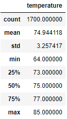
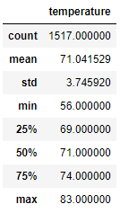

# Surfs_Up

Analyzing Weather Data of O'ahu, Hawaii

## Resources
- Python 3.8.5
- Jupyter Notebook 6.3.0
- SQLite

## Overview:

This will be an analysis of temperature statistical data of the two seasons in O'ahu, Hawaii. This analysis will determine if opening a surf and ice cream shop in O'ahu is a viable and profitable plan based on climate. In order to make this determination, we will use temperature data from June and December for our analysis. 

## Analysis

The temperature data will be run by two seperate queries. The first will be for June, and the second will be for December. After the queries, the data from the temperatures will be stored in a list and subsequently converted to a dataframe. The dataframe will show our summary statistics for each month. 

### June Temperatures Summary

June's Temperature Statistical Data shows a count of 1700 with the average temperature being 74.94 degrees; which is fairly warm temperature. Room temperature is considered to be between 68-72 degrees and this is slightly above that. The low for the temperature in June is 56 degrees and and the high is 85 degrees. 

### December Temperatures Summary

December's Temperature Statistical Data shows a count of 1517 with the average temperature being 71.04 degrees; which is a moderate temperature. The low for the temperature in Decmeber is 64 degrees and and the high is 83 degrees. 

The standard deviation for June is 3.25 and for December is 3.75 showing a difference of .50 between both seasons.

## Summary 

From the data we can see that the temperature in O'ahu doesn't fluctuate too much. The average temperatures stays in a close range of 71 - 75 degrees, showing only a 4 degree difference. We can also observe this through the standard deviation, which has a small difference of only 3.25 and 3.75. This small .5 difference between the 2, proves that the weather does move too far away from it's average. 

Another conclusion that can be drawn from this data is that O'ahu doesn't have temperatures that reach too low or too high on a consistent basis. And even on its coldest day that temperature doesn't normally go under 60 degrees or above 85 degrees on it's hottest days. These warm temperatures are very good for tourism, especially since ice cream is more desirable in  warm weather. This would likely draw a good amount of traffic to the shop.

There is another concern that should be considered in regards to weather. Although ice cream and surfing are strong desireables in warm weather, neither are heavily seeked if it is raining or there is a chance of a hurricane. Due to the tropical climate of O'ahu, both of these forms of weather are likely and can alter the success of a shop. This data should also be queried and run to determine the frequency of both rainfall and hurricane frequency to get a more detailed perspective of the shops possible success.
